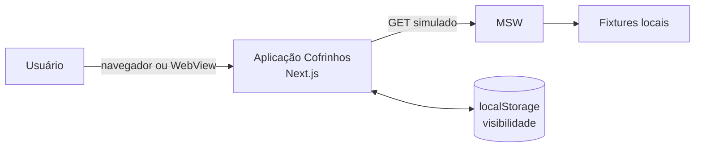
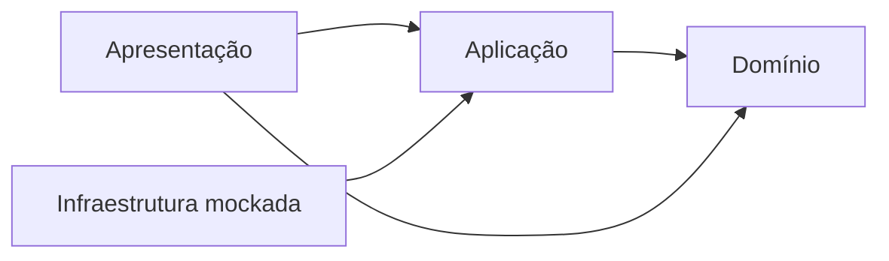
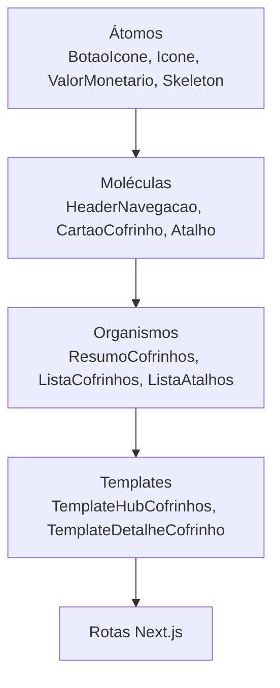
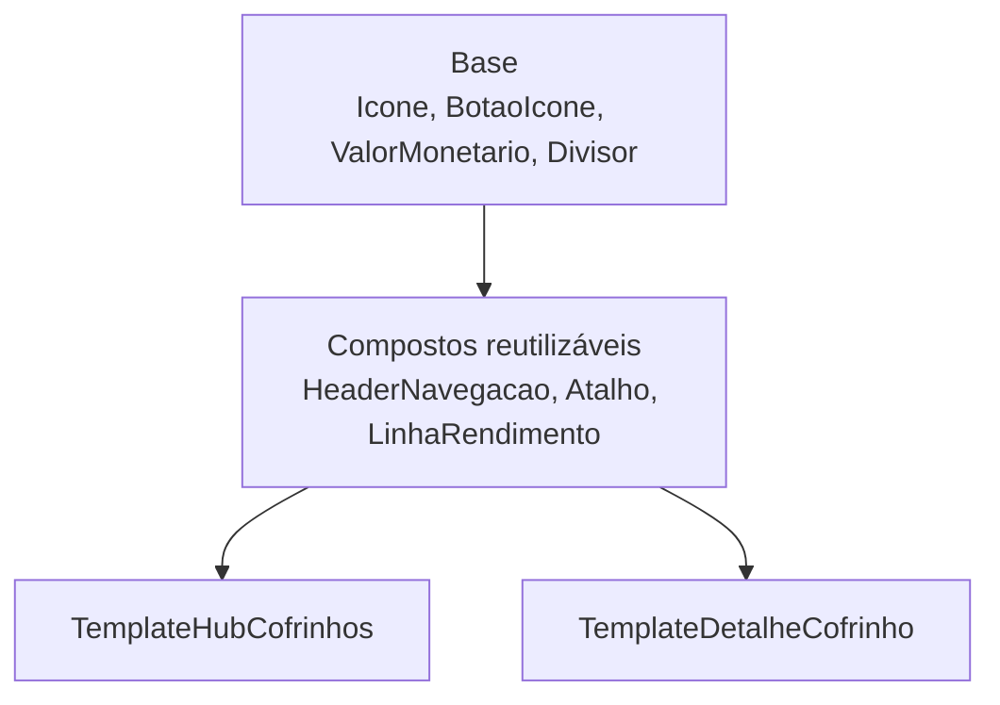
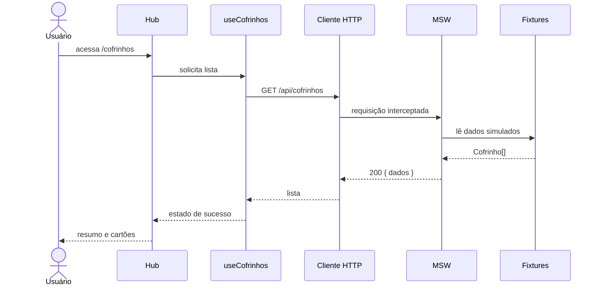
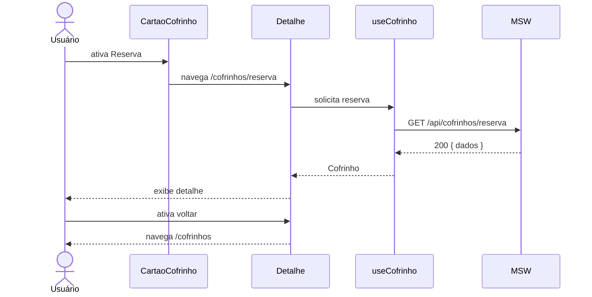
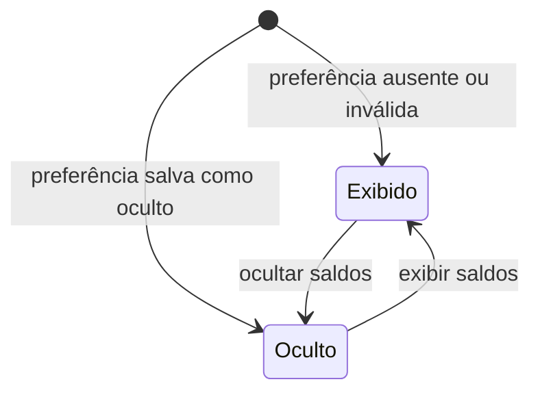
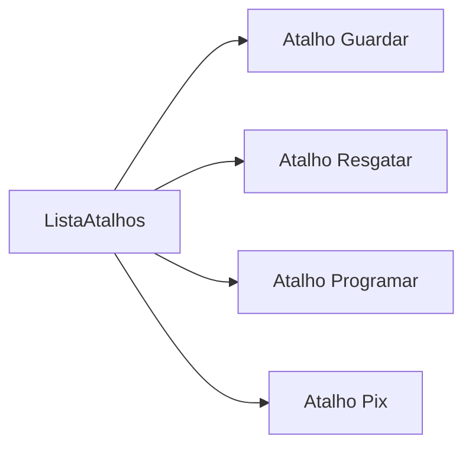
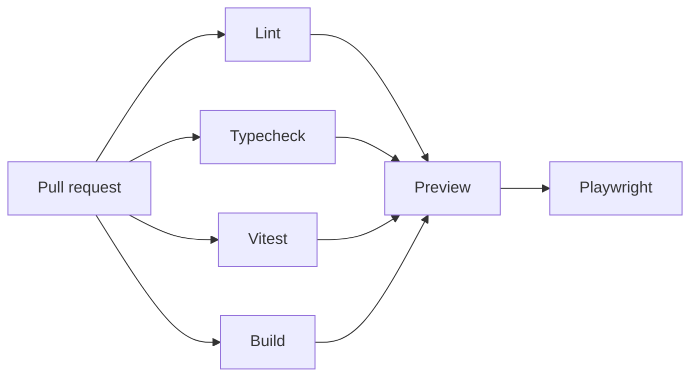

# Arquitetura — Cofrinhos

## 1. Objetivo

Este documento apresenta somente a arquitetura necessária para o fluxo de consulta do Hub e detalhe de Cofrinhos.

## 2. Visão de contexto



O MSW intercepta os contratos de leitura e responde usando fixtures versionadas no projeto.

## 3. Tecnologias

| Responsabilidade | Tecnologia |
|---|---|
| Aplicação | Next.js com App Router |
| Interface | React |
| Tipagem | TypeScript estrito |
| Estado remoto | TanStack Query |
| API mockada | MSW |
| Estado de privacidade | Context + hook próprio |
| Persistência da preferência | `localStorage` |
| Estilos | CSS Modules + BEM |
| Organização visual | Atomic Design |
| SVGs e ilustrações | Phosphor Icons encapsulado por `Icone` |
| Testes | Vitest + React Testing Library |
| Acessibilidade automatizada | `vitest-axe` |
| Cobertura | `@vitest/coverage-v8` |
| E2E | Playwright |

## 4. Estrutura

```text
src/
├── app/
│   └── cofrinhos/
│       ├── layout.tsx
│       ├── page.tsx
│       ├── loading.tsx
│       ├── error.tsx
│       └── [id]/
│           ├── page.tsx
│           ├── loading.tsx
│           └── not-found.tsx
├── componentes/
│   ├── atomos/
│   ├── moleculas/
│   ├── organismos/
│   └── templates/
├── funcionalidades/
│   └── cofrinhos/
│       ├── dominio/
│       ├── aplicacao/
│       ├── infraestrutura/
│       └── apresentacao/
├── compartilhado/
│   ├── estilos/
│   ├── testes/
│   └── utilitarios/
└── simulacoes/
    ├── dados.ts
    ├── handlers.ts
    ├── navegador.ts
    └── servidor.ts
```

## 5. Camadas e dependências



### Domínio

Contém `Cofrinho`, `IconeCofrinho`, `VisibilidadeSaldo` e regras puras de soma e formatação, mantendo independência das camadas externas.

### Aplicação

Define os contratos de leitura:

```ts
export interface RepositorioCofrinhos {
  listar(): Promise<Cofrinho[]>;
  obterPorId(id: string): Promise<Cofrinho | null>;
}
```

### Infraestrutura

Implementa o cliente HTTP que consome `/api/cofrinhos` e `/api/cofrinhos/{id}`. Em execução local e testes, o MSW responde a essas chamadas.

### Apresentação

Contém páginas, componentes, hooks de consulta e o provider de visibilidade.

## 6. Árvore de componentes



Os componentes são próprios. CSS Modules isola os estilos e BEM nomeia elementos internos.

Phosphor Icons é a fonte única dos SVGs. Páginas e componentes compostos consomem somente o componente próprio `Icone`; imports do pacote ficam concentrados no catálogo interno de ícones. Ícones de interface usam peso `regular` e representações ilustrativas usam `duotone`.

### Regra de reutilização

Hub e detalhe utilizam o mesmo conjunto de componentes de base. Uma variação visual deve ser expressa por propriedades como `tamanho`, `variante`, `visibilidade` e callbacks opcionais. Não serão criadas cópias específicas por tela quando anatomia e comportamento forem equivalentes.



Os templates organizam componentes e espaçamentos próprios de cada página. Eles não duplicam a implementação dos componentes compartilhados.

## 7. Fluxo do Hub



## 8. Fluxo do detalhe



Se o identificador não existir, o MSW responde `404` e a rota apresenta o estado de não encontrado.

## 9. Estado de visibilidade



`ProvedorVisibilidadeSaldo` envolve as duas rotas no layout de `/cofrinhos`. O provider:

- lê `localStorage` após a montagem no cliente;
- disponibiliza estado e função de alternância;
- persiste mudanças;
- usa `exibido` como fallback seguro.

`ValorMonetario` decide entre moeda formatada e máscara. Quando oculto, não renderiza o valor real na árvore acessível.

## 10. Atalhos horizontais



`ListaAtalhos` controla layout e scroll horizontal. `Atalho` renderiza um botão reutilizado nas duas telas e recebe callback opcional:

```ts
type PropriedadesAtalho = {
  titulo: string;
  ilustracao: React.ReactNode;
  tamanho: "pequeno" | "medio";
  variante?: "neutra" | "destaque";
  aoAtivar?: () => void;
};
```

O Hub usa `tamanho="medio"`; o detalhe usa `tamanho="pequeno"`. Guardar usa `variante="destaque"`. As instâncias atuais usam `aria-disabled="true"`, permanecem focáveis e impedem a ativação.

## 11. Tag CDI

“100% do CDI” é texto estático da apresentação.

## 12. Estratégia de renderização

- Server Components por padrão.
- Client Components somente para TanStack Query, visibilidade, interação e scroll quando necessário.
- `layout.tsx` da área instala os providers.
- `loading.tsx`, `error.tsx` e `not-found.tsx` representam os estados de rota.
- A leitura de `localStorage` acontece apenas no cliente, evitando acesso durante SSR.

## 13. Acessibilidade estrutural

- `BotaoIcone` exige nome acessível.
- `CartaoCofrinho` possui um único link e não aninha controles.
- `ValorMonetario` centraliza a proteção do valor oculto.
- `Atalho` anuncia indisponibilidade com `aria-disabled`.
- `ListaAtalhos` permite rolagem sem prender o teclado.
- O foco é visível e segue a ordem visual.
- Títulos e landmarks identificam as páginas.

## 14. Testes por camada

| Camada | Ferramentas e cobertura |
|---|---|
| Domínio | Vitest para soma, moeda e máscara |
| Estado | Vitest para Context e `localStorage` |
| Componentes | Vitest, Testing Library e `vitest-axe` |
| HTTP | Vitest e MSW para sucesso, erro e `404` |
| Rotas | Vitest para integração dos estados |
| Jornada | Playwright para Hub → detalhe → Hub |

## 15. Pipeline



O deploy publica somente frontend e fixtures demonstrativas. Nenhum segredo ou serviço externo é necessário.
